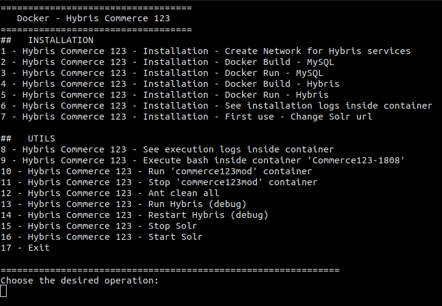

#  SAP Commerce 123 (Hybris) Docker :octocat:
An unofficial image docker based on SAP Commerce 123 (Hybris).

## :page_with_curl: About this project
When we are new to learning Hybris, we commonly start by learning Hybris from SAP Commerce 123 (Hybris), which is a series of guided tours that introduce you to the features of SAP Commerce (Hybris).

However, its initial configuration can be a little difficult and/or too time consuming.

This project adds the complete SAP Commerce 123 installation process via Docker. :)

## Run this project :computer: :computer_mouse:
#### Prerequisites
- Docker;
- Hybris and dependencies files:
  - Hybris ZIP;
  - Java JDK;
  - MySQL Connector (if you want to use MySQL as database)

#### Step by step

1. Clone this repository;

2. Docker needs to have all files under the same root as Dockerfile to correctly build its images. So, provide below files to same root as Dockerfile;
- Hybris ZIP;
- Java JDK;
- MySQL Connector (if you want to use MySQL as database)

3. Create Network for Hybris services:
  `docker network create commerce123mod-net --subnet=172.100.0.0/16 --gateway=172.100.0.1`

4. Docker Build - MySQL (if you want to use MySQL as database):
  `docker build . -f mysql/Commerce123-mysql.Dockerfile -t commerce123mod-mysql:5.7`

5. Docker Run - MySQL (if you want to use MySQL as database):
  `docker run -it -d --name Commerce123-mysql-57 -h Commerce123-mysql-57 --network=commerce123mod-net --ip 172.100.0.102 commerce123mod-mysql:5.7`

6. Docker Build - Hybris:
  `docker build . -f Commerce123.Dockerfile -t commerce123mod:1808`

7. Docker Run - Hybris:
  `docker run -it -d --name Commerce123-1808 -h Commerce123-1808 -v /app/Commerce123Mod:/app/Commerce123Mod/  --network=commerce123mod-net --ip 172.100.0.101 -e DB_USERNAME=docker_hybris -e DB_PASSWORD="docker_hybris" commerce123mod:1808`

8. See installation logs inside container:
  `docker exec -it Commerce123-1808 bash`
  `cd ~ && tail -f entrypoint.log`

## Usage
- Run MySQL container (if you chose to use MySQL as database):
  `docker start Commerce123-mysql-57`

- Run Hybris container:
  `docker start Commerce123-1808`

- Stop MySQL container (if you chose to use MySQL as database):
  `docker stop Commerce123-mysql-57`

- Stop Hybris container:
  `docker stop Commerce123-1808`

- Stop 'commerce123mod' container

## Remarks & Tips :ok_hand:
1. The entire Docker command process can be executed by a script file, called "docker_hybris.sh". Just configure it with the properties of your environment.
2. There is the option to already initialize SAP Commerce 123 as soon as Hybris is installed. To do this, set the "INITIALIZE" environment variable to "true";
3. Pay special attention to the defined variables in Dockerfile, specially the variable "INITIALIZE";
4. Check the other arguments (ARG) and environment variabels (ENV) and adapt to your needs;
5. For a better experience with SAP Commerce 123, and to avoid errors with Solr, it is better to disable SSL from it. Therefore, set the "USE_MYSQL_DB" environment variable to "false";
6. In addition, it is necessary to update the Solr address with the URL of the network Docker, in addition to switching from HTTPS to HTTP, if you prefer, use the script "docker_hybris.sh";
7. By default Hybris is configured with the HSQLDB Database. If you prefer to use MySQL, set the "USE_MYSQL_DB" environment variable to "true";
8. **Last but not least, remembering... use the "docker_hybris.sh" which contains a step by step execution of the whole process to get everything working :)**

See a screenshot of "docker_hybris.sh" file:

## Installing Docker

If you haven't installed Docker yet, follow instructions below.

### Ubuntu

1. Install some dependencies:
  `sudo apt-get install apt-transport-https ca-certificates curl software-properties-common`

2. Add the official Docker GPG key:
  `curl -fsSL https://download.docker.com/linux/ubuntu/gpg | sudo apt-key add -`

3. Set the Docker respository as stable:
  `sudo add-apt-repository "deb [arch=amd64] https://download.docker.com /linux/ubuntu xenial stable"`

4. Update the repository list:
  `sudo apt-get update`

5. Install last version of Docker CE:
  `sudo apt-get install docker-ce -y`

6. Add the actual user in group "docker", to not to no longer need sudo when running Docker:
  `sudo usermod -aG docker $USER`

7. Verifiry if the Docker installation occurred correctly, by running a hello-word image: 
  `sudo docker run hello-world`

PS: $USER is an Shell variable to logged user, if this variable are configuring for another user, you must put his name instead.

### Windows
Follow official instructions for [Installation on Windows](https://docs.docker.com/docker-for-windows/install/) from the Docker website.

### Mac OS
Follow official instructions for [Installation on Mac OS](https://docs.docker.com/docker-for-mac/install/) from the Docker website.

## Server endpoints
In this Docker image we created an exclusive network for Hybris.
- Hybris Administration Console (HAC): `https://172.100.0.101:9002/`
- Backoffice: `https://172.100.0.101:9002/backoffice`
- B2C accelerator: `https://172.100.0.101:9002/yacceleratorstorefront/en/?site=apparel-uk&clear=true`

## References
https://github.com/paulosantoos/docker
 https://github.com/pwittchen/ydocker
